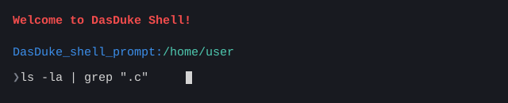

# DasDuke Shell

A small Unix command-line shell written in C, built on top of `fork`, `execvp`, `pipe`, and `wait`. It runs external programs, chains two commands together with a pipe, supports a built-in `cd`, and lets you browse previous commands with the up/down arrow keys.



## Features

- **Command execution** — parses the typed line into arguments and runs it as a child process via `fork()` + `execvp()`, while the parent waits for it to finish.
- **Piping (`|`)** — one pipe per command line is supported. The line is split on the first `|` into a left-hand and right-hand command; `execute_pipe_command` wires the two together with `pipe()`, forks a child for each side, and connects them with `dup2` (left child's stdout → pipe, right child's stdin → pipe).
- **Built-in `cd`** — implemented directly in the shell (not delegated to `execvp`), using `getcwd()` and `chdir()`:
  - `cd <path>` — change into a given directory
  - `cd` or `cd ~` — jump to the `$HOME` directory
  - `cd -` — return to the previous working directory
- **`exit` / `quit`** — terminates the shell.
- **`clear`** — clears the terminal (shells out to `system("clear")`).
- **Command history** — powered by GNU Readline (`add_history`), so previous commands can be recalled with the up/down arrow keys.
- **Live prompt** — shows the current working directory before every command, refreshed with `getcwd()` on each loop iteration.
- **Colored output** — a small helper library (`src/colour.h`) wraps ANSI escape codes into simple functions (`red`, `green`, `blue`, `yellow`, `cyan`, `magenta`, `white`, `black`) used to color the welcome message and prompt.
- **Error handling** — invalid commands are reported via `perror`, and `fork()` failures are translated into readable messages for `EAGAIN`, `ENOMEM`, and `ENOSYS`.

## How it works

The project is split into a few small, focused files:
- `src/DasDuke_Shell.c` -> main read–parse–execute loop: prints the prompt, reads a line with Readline, tokenizes it, detects a pipe, and dispatches to the pipe executor, the built-in `cd`/`exit`/`clear`, or the general executor.
- `src/DDS_functions.c` -> Core shell logic — `execution_of_command` (fork/execvp/wait), `execute_pipe_command` (two-process pipe), `change_directory` (the `cd` built-in), `return_args` (tokenizer), and `errors_errno` (fork error messages).
- `src/DDS.h` -> Shared includes, constants (`MAX_wd_string_size`, `MAX_args_string_size`), and function declarations.
- `src/colour.h` -> ANSI color helper functions used for terminal output.
- `Makefile` -> Build rules for compiling and linking the project against `readline`.

## Requirements

- A Unix-like OS (Linux/macOS)
- `gcc` (or another C99-compatible compiler)
- `readline` development headers/library installed

On Debian/Ubuntu:
```console
sudo apt install build-essential libreadline-dev
```

On macOS (Homebrew):
```console
brew install readline
```

## Build & run

```console
# Clone the repository
git clone https://github.com/Dan-Andrei-Simionescu/DasDuke_Shell.git
cd DasDuke_Shell

# Build
make build

# Build and run in one step
make run

# Remove the compiled binary
make clean
```

The Makefile compiles with `-Wall -Wextra -std=c99 -D_GNU_SOURCE` and links against `-lreadline`.

## Usage examples

```console
❯ ls -la
❯ cd Projects
❯ cd ~                    # go to $HOME
❯ cd -                    # jump back to the previous directory
❯ ls -la | grep ".c"      # single pipe between two commands
❯ ps aux | grep "shell"   # quoted grep pattern is un-quoted automatically
❯ clear                   # clear the terminal
❯ exit                    # or: quit
```

Use the ↑ / ↓ arrow keys at the prompt to cycle through previously entered commands.
